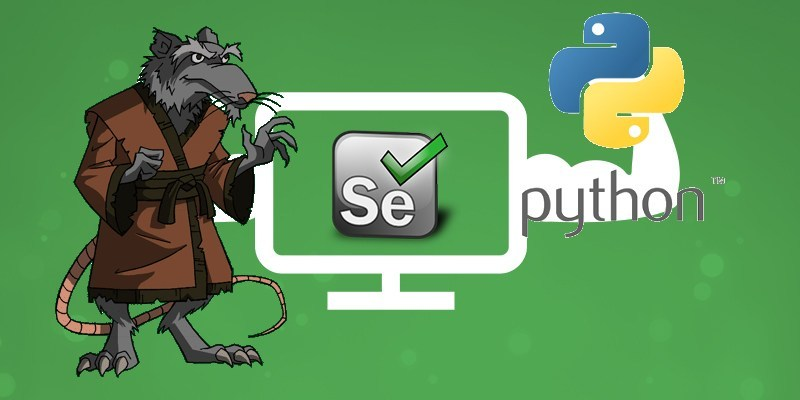
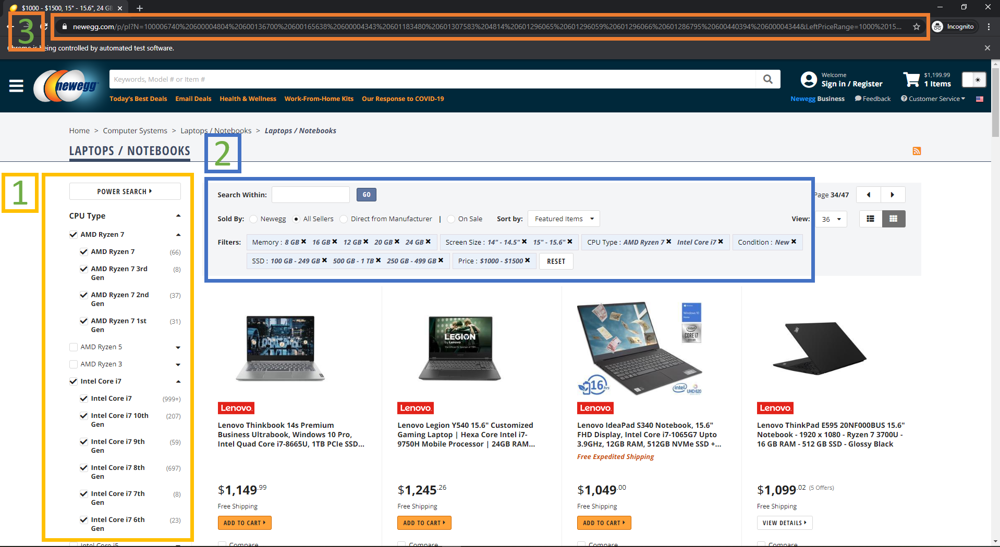
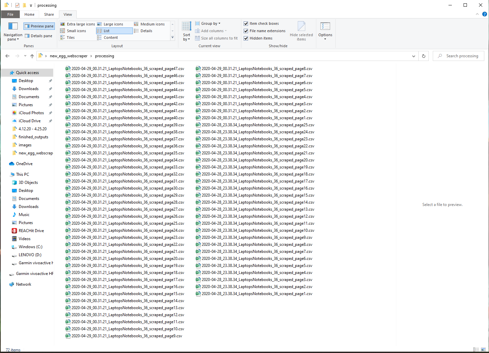
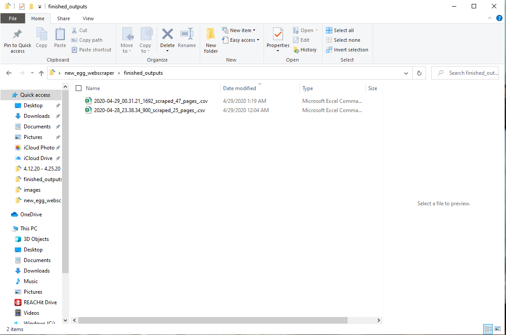
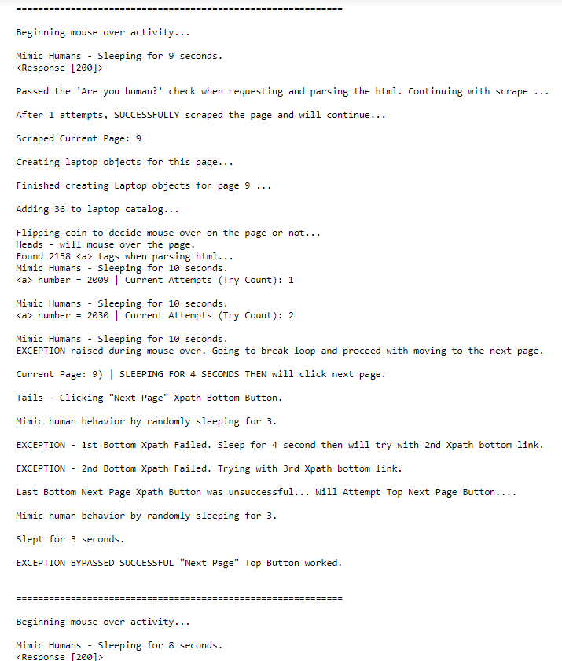
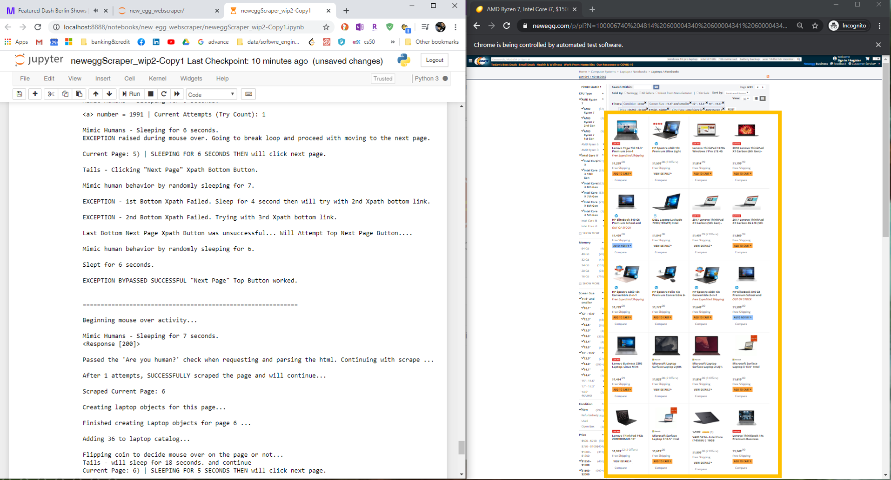
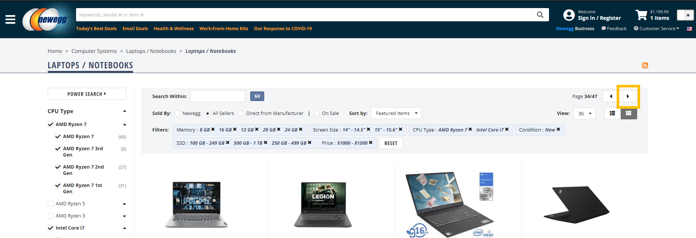
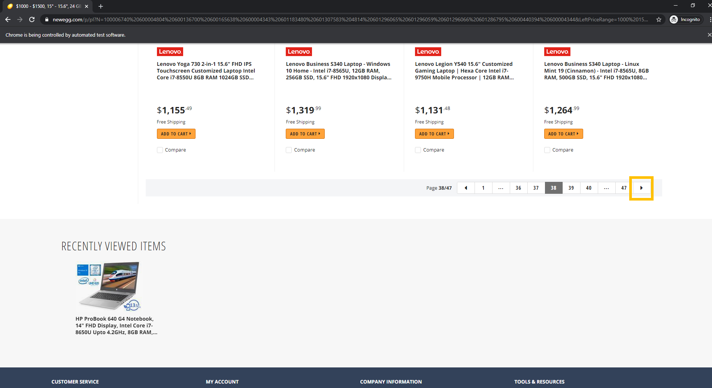
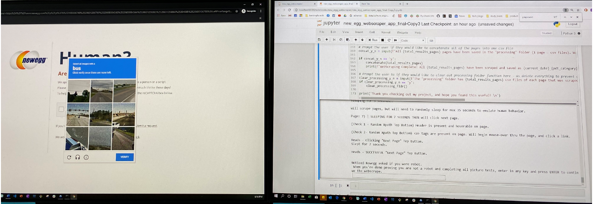
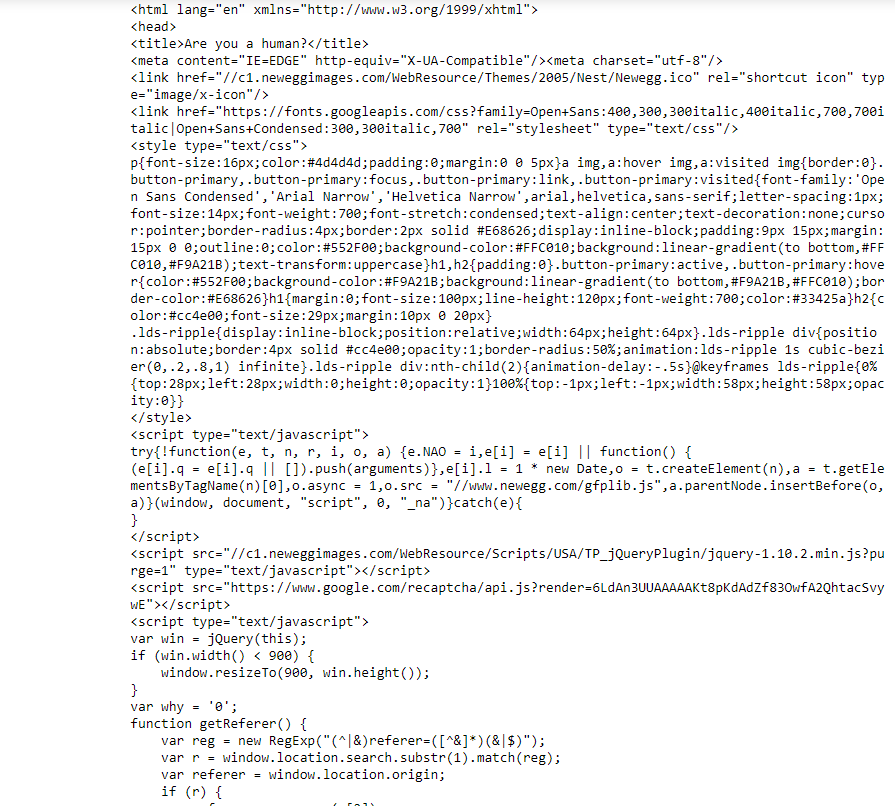

# NewEgg.com WebScraper And Crawler For Laptops
## April 2020

## Scope & Purpose

* For this project, I built a Newegg.com laptop web scraper and page crawler program that succesfully scraped 25 and 47 pages, with 900 and 1,692 laptops scraped including their: brand, product category, image (link), model specifications and details, product links, item numbers, current promotion information (if applicable), price, and page number. You will find examples of each scarped page in the processing folder, and a concatenated version in one file in the file output folder. There are built in functions to alert the user when Newegg suspects a bot via sound effects, and provides suggested actions to circumvent their defenses. This is a supervised web crawler and scraper that is 80% automated, and requires about 20% or less effort from the user. Once the scraper is setup, you can leave the program running in the background while working on other tasks. The objective for this project was to further develop my data extraction and Python skills, and build a robust webscraper with the limited time I invested into this project. Data mining from the web (the "E" in ETL) is an essential skill as a Data Engineer and analyst, and that was my main focus for this project.

## Background Information

* My inspiration came from an YouTube video called "Introduction To WebScraping With Python and BeautifulSoup" by Data Science Dojo in the beginning when I was finding my way. This video that began the snowball effect of my progress, and it was instructed and narrated by Mr. Phuc Duong (Sr. Data Science Engineer). I will post the link in the credits at the end. Although this video was made 3 years ago, and versions of Python and BeautifulSoup he used were older, Mr. Duong did a great job in explaining the underlying concepts of webscraping with BeautifulSoup. I was able to reproduce the same results, and even add my own flare to it by referring to updated documenation. After achieving initial success of scraping one page of laptops from the website, I wanted to further challenge myself by building a webcrawler capability that automatically loops through as many pages as my search query produced, scrapes all the important laptops data, and output CSV files and Python objects. To do this, I decided to use Splinter for the following reasons: Splinter is wrapper on top of Selenium that is Python based, as opposed to Selenium being originally JavaScript based (https://python.libhunt.com/compare-splinter-vs-selenium); Splinter is said to be gaining popularity; and Python is my natural strength. I found Splinter and the Chrome Web Driver that enables the user to write code to automate the Chrome browser relatively easy to implement. Thoughout my program, I also made a genuine effort to weave in dyanmic and object oriented programming concepts, which I found made my code more scalable, efficient, and stylistically cleaner.

## System Prerequisites To Get Started

You will need the following installed on your computer system and import the following libraries:
* Python >= 3.7
* import os
* import re
* import glob
* import time
* import random
* import requests
* import datetime
* import pandas as pd
* from re import search
* from splinter import Browser
* from playsound import playsound
* from bs4 import BeautifulSoup as soup
* Jupyter Notebook - all of the programming reside in these files

## Getting Started - Two Options

* Only Viewing The Source Code And Produced Results - if this is the route you'd like to go, then please click on the only and conveniently placed Jupyter Notebook in the repository. All of my code, webcrawling and scraping program logs are in the main Jupyter Notebook. I've also saved the results log from my program when I completed a 47 page scrape in the txt file. In the final_ouputs and processing folder, you will see the 25 and 47 page successful scrapes my program produced saved as CSV files.

* Clone / Download Entire Repository - if you'd like to replicate my work or even use the scraper yourself, please download / clone my repository and install all of the prerequisites. After, you can open the Jupyter Notebook, use the same search query I did or go to Newegg.com, and input a search URL you queried yourself from the site. The Jupyter Notebook allows you to run everything cell by cell, incase you need to make any tweaks. I'd recommend scraping towards midnight for the best results, which is explained more in the "Encountering Potential Errors" section below.

## Main Built-in Functionalities

* NewEgg Web Scarper Functions - this function will keep trying to scrape the target page using a combination of while loop, random sleep patterns to emulate human behavior, and try and excepts. The output are a csv file per scraped page; all laptops on a page are then passed into a Laptop class, and instances of these objects  are created using a list comprehension, and are subsequently appended to a list called "product_catalog", producing a "list of list of objects".

* Splinter Webcrawler Functions - accurately loops thru pages of the search result; decides to randomly mouse over product links on pages by "flipping a coin" every page that is iterated through; and randomly sleeps and clicks the top or bottom next page button to emulate human behavior.

* Concatenation Function - enables the user concatenate all scarped pages in the processing folder into one CSV file after entire scrape is completed, and is saved in the final_outputs folder. Note: as of right now, anything in the processing folder will be concatenated unless physically moved out or cleared, which segways to the function below.

* Clear Processing Folder Function - enables the user to clear out the "processing" folder to prevent clutter; I opted not to clear the this folder and intentionally left / moved files in files back into the processing folder as an example.

* Google reCAPTCHA and NewEgg's "Are You Human?" Test Functions - these scans the requested HTML, pauses the program, and alerts the user if Newegg suspects a bot and provides suggested actions to help the user circumvent Newegg's defenses to be successful in their scrape. I created these because I kept running into exceptions and errors, and I wanted to find ways around them by first catching, implementing what I refer to as a "break pedal", to give user an opportunity to manually circumvent the errors, if my try and excepts do not work. This is why I called this a "supervised scrape", which requires 20% of the effort from the user, and 80% the scraper will handle for you.

## Expectations - User Inputs And Outputs

* Input requirement from the user is Step 3 in the picture below, which the user goes to Newegg.com, selects preferred laptop specifications and clicks apply, and copy and pastes the search query results's URL into the program when prompted.

* Three Potential Outputs:

1) Each Scraped page as a seperate CSV file in the processing folder

2) One CSV file of all pages scraped in one CSV file in the final_output folder

## Program Preview And Findings

* Welcome to NewEgg.com Supervised Web Crawler and Scraper - please see an example of the introduction to the program and where and how the user will be asked to input the URL to their custom laptop search query.

* After the user input a search query URL, here is a sample of what to expect as when the program is web scraping, and crawling down the page and over to the next.

* Laptops in the yellow square is what the scraper targets every page.

* Examples Of Top And Bottom Next Page Buttons The Web Crawler Randomly Targets Page-To-Page By "Flipping A Coin".

* Note: For the Bottom Next Page Button - I found that NewEgg.com had more of a tendency to change bottom divs when you get deep into the scrape especially, when it suspects the user is a bot, or after the user was prompted to take a Google reCAPTCHA test.

* Programmed "Break Pedals" - the program will pause and user will be alerted when Newegg suspects the user is a bot. After the user takes necessary actions to by pass it, the user is asked to enter in any key to attempt to continue the scrape. Below are examples:

## Encountering Potential Errors

* Potential Errors in the event the program is unable to circumvent Newegg's reCAPTCHA (Developed by Google) to help protect websites from being webscraped by requiring website visitors to complete image selections tests to prove the user is a human and not a bot. As you can imagine, this was the most difficult obstacle about this project I had to figure out a way to overcome, which is why this why I call this a "supervised webscraper and crawler", as the user is prompted to take action to circumvent their defenses. I also found that the timing of when you decide to scrape is also important. I strongly hypothesize Newegg employs machine learning along with Google's reCAPTCHA to predict which users are bots scraping their data based on all users traffic and actions from that day. As you may know, most commerical websites collect data on how long users are on their page, which links they interact with, and etc. With this said, I found that when I scraped late around midnight, was when I had the best results and was most successful.
  
- Google reCAPTCHA Test Example Below:

* Post reCAPTCHA Test - Passed And the Scraper Continues Example Below:

* Additional notes regarding scraping errors - Every time I made an attempt to scrape Newegg.com, it got harder and harder. I believe this is because in addition to using Google reCAPTCHA, they also have JavaScript triggers to load elements at certain times or based on certain user actions. I do beleive they use machine learning as well and compare your actions based on an entire days worth of data. I found the JavaScript does change up certain div tags for the next page buttons. Also, when requesting the the HTML after completing a "Are you human?" test where you have to select images of either cars, crosswalks, fire hydrants, buses or etc, Newegg would send a bogus HTML on the back end to BeautifulSoup4, which cases an Index Error for the scraper. To circumvent this, I have the program automatically refresh the page for you, and establishing a manual break where you the user would take the suggested action (e.g. add an item to a cart as if you were popping and literally using the back button on your browser to the page you last left off scraping). The "Are you human?" function will trigger next, and scan the new requested text for bogus unscrapabe "Are you human?" HTML, as seen in the picture below, causing an Index error. The "Are you human?" function would then be recursively called again, to scan the new requested HTML, if it passes, the scrape will continue. 

* "Are you human?" HTML - what it looks like when they send you bogus HTML to ruin your scrape on the backend:

## Next Steps Considerations

* Reiterate on loops, put top and bottom xpaths into a list, and create a loop including tries and excepts instead of manually brute forcing. Goal would be to cut down redundant code and make it more elegant.
  
* Create nice charts and data visualizations with the data.

* Learn how to use Selenium which is the OG to Splinter - perhaps for my next project.

### Personal Note

* Hope you enjoyed it. Thank you for your time!

## Author

* **Johneson Giang** - *Invidual Project* - [Github](https://github.com/jhustles)

## License

This project is licensed under the MIT License - see the [LICENSE.md](LICENSE.md) file for details

## Acknowledgments & Credits

* Shout out to Mr. Phuc Duong for the great video that helped inspire this project - Sr. Data Science Engineer @ Data Science Dojo - https://www.youtube.com/watch?v=XQgXKtPSzUI

* I definitely want to give a shout out to my dear teacher, mentor, and friend @CodingWithCorgis!